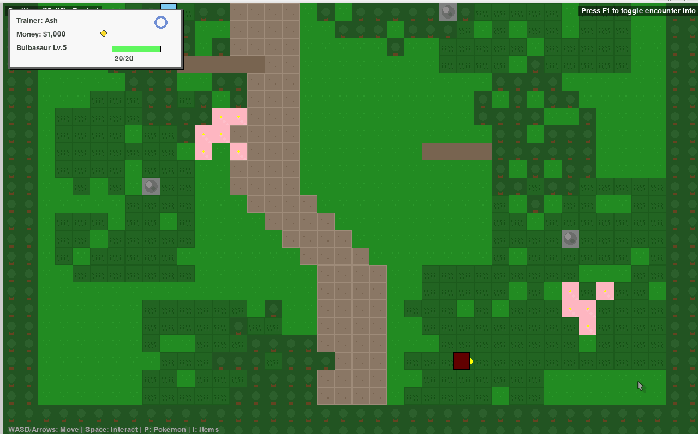

# 🎮 Pokemon Game

A feature-rich Pokemon-style RPG game built with Python and Pygame, featuring turn-based battles, world exploration, and all the classic Pokemon mechanics you love!



## 🎯 Overview

This Pokemon Game is a comprehensive recreation of the classic Pokemon gaming experience. Explore a vibrant tile-based world, catch and train Pokemon, battle other trainers, and become the Pokemon Champion!

## ✨ Features

### Core Gameplay
- **Starter Pokemon Selection** - Choose between Bulbasaur, Charmander, or Squirtle
- **Turn-Based Battle System** with:
  - Type effectiveness system (18 types)
  - Physical/Special move split
  - Status conditions (Paralysis, Burn, Poison, Sleep, Freeze)
  - Stat modifications
  - Critical hits and accuracy/evasion
  - Experience and leveling system
  - **NEW: Battle animations with type-specific effects!**
  - **NEW: Screen shake for powerful moves**

### Enhanced Battle System 🆕
- **Visual Attack Animations**:
  - Electric type: Lightning bolt effects
  - Fire type: Flame particle effects
  - Water type: Bubble splash effects
  - Fighting/Normal: Impact hit effects
  - Grass/Ghost/Dark: Slash effects
- **Keyboard Controls**: Navigate with arrow keys, confirm with Enter/Space
- **Auto-battle progression**: Battles automatically end after 3 seconds
- **Improved UI layout**: All elements properly positioned and visible

### World Exploration
- **Grid-Based Movement** - Classic Pokemon-style with smooth animations
- **Enhanced Movement Speed** - 2x faster movement (8 tiles/sec, 12 when running)
- **Smart Collision System** - Player faces obstacles when blocked
- **Multiple Connected Maps** - Seamless transitions between areas
- **Different Terrain Types**:
  - Normal ground and paths
  - Tall grass (wild Pokemon encounters - 10% chance per step)
  - Buildings with interiors
  - Trees and obstacles
  - Water (Surf required - future feature)

### Pokemon System
- **Available Pokemon with Sprites**:
  - Starters: Bulbasaur (#1), Charmander (#4), Squirtle (#7)
  - Common: Pikachu (#25), Eevee (#133)
  - Rare: Gengar (#94), Snorlax (#143), Dragonite (#149)
  - Legendary: Articuno (#144), Zapdos (#145), Moltres (#146), Mewtwo (#150), Mew (#151)
  - Evolution: Charizard (#6)
- **Comprehensive Pokemon Mechanics**:
  - Individual stats (HP, Attack, Defense, Sp. Attack, Sp. Defense, Speed)
  - Natures affecting stat growth
  - Abilities with in-battle effects
  - Move learning and PP system
  - Shiny Pokemon (0.1% chance)
  - Evolution (coming soon)

### NPCs and Interactions
- **Various NPC Types**:
  - Townspeople with helpful dialogue
  - Trainers for battles
  - Professor Oak for guidance
  - Nurse Joy for Pokemon healing
  - Item givers

### Items and Inventory
- **Item Categories**:
  - Healing items (Potions, Super Potions)
  - Poke Balls for catching Pokemon
  - Battle items (X Attack, X Defense)
  - Key items for progression

## 🚀 Getting Started

### Prerequisites
- Python 3.10 or higher
- uv (Python package manager) - [Install from here](https://github.com/astral-sh/uv)

### Setup Instructions

1. **Clone the repository**
   ```bash
   git clone https://github.com/gyupro/poketmon_game.git
   cd pokemon_game
   ```

2. **Install dependencies**
   ```bash
   uv pip install -r requirements.txt
   ```
   Dependencies:
   - pygame==2.5.2
   - requests==2.31.0
   - pillow==10.2.0

3. **Run the game**
   ```bash
   uv run main.py
   ```

## 🎮 How to Play

### Starting the Game
1. Run the game using the command above
2. Choose "New Game" from the main menu
3. Select your starter Pokemon
4. Begin your adventure in Pallet Town!

### Controls

#### World Exploration
| Key | Action |
|-----|--------|
| Arrow Keys / WASD | Move character |
| Hold Shift | Run (move faster) |
| Space | Interact with NPCs/Objects |
| I | Open Inventory |
| P | Open Pokemon Menu |
| ESC | Pause Menu |
| F1 | Toggle encounter rate display |

#### Battle Controls 🆕
| Key | Action |
|-----|--------|
| Arrow Keys | Navigate menus |
| Enter/Space | Confirm selection |
| ESC | Go back |
| 1-4 | Quick select move (when available) |

### Finding Wild Pokemon
1. Exit Pallet Town from the **top** (around coordinates x=20, y=0)
2. Once in Route 1, walk through the **tall grass** areas
3. Wild Pokemon encounters are automatic (12% chance per step)

### Game Objectives
- Build a strong team of Pokemon (up to 6)
- Explore all areas and talk to NPCs
- Catch different types of Pokemon
- Train your team in wild encounters
- Heal at Pokemon Centers
- Battle trainers and improve your skills
- Become the ultimate Pokemon trainer!

### Tips for New Players
- **Type effectiveness is crucial** - Super effective moves deal 2x damage!
- **Status conditions matter** - Paralysis reduces speed, burn reduces attack
- **Keep a balanced team** - Different types cover different weaknesses
- **Talk to all NPCs** - They give items and helpful information
- **Heal frequently** - Visit Pokemon Centers to restore your team
- **Explore tall grass** - Different areas have different Pokemon
- **Watch your PP** - Moves have limited uses before needing restoration

## 🗺️ World Guide

### Available Locations
1. **Pallet Town** - Your hometown
   - Professor Oak's Lab
   - Pokemon Center
   - Your rival Gary

2. **Route 1** - First wild area
   - Common: Bulbasaur, Charmander, Squirtle
   - Uncommon: Eevee, Pikachu
   - Rare: Gengar, Snorlax, Dragonite
   - Very Rare: Mew, Charizard

3. **Viridian Forest** - Bug Pokemon habitat
   - Various Pokemon including starters
   - Higher level Pokemon than Route 1

4. **Mt. Moon** - Cave system
   - Unique Pokemon like Gengar
   - Higher encounter rates

5. **Cerulean Cave** - End-game area
   - Legendary Pokemon (Mewtwo, Mew)
   - Requires defeating Elite Four

## 📁 Project Structure

```
pokemon_game/
├── main.py                 # Game entry point
├── requirements.txt        # Dependencies
├── README.md              # This file
├── Animation.gif          # Battle animation demo
├── src/                   # Source code
│   ├── game.py           # Main game loop
│   ├── pokemon.py        # Pokemon classes and data
│   ├── battle.py         # Battle system logic
│   ├── battle_animations.py  # NEW: Visual effects
│   ├── player.py         # Player management
│   ├── ui.py             # User interface
│   ├── world.py          # World and NPC management
│   ├── map.py            # Map system and tiles
│   ├── encounters.py     # Wild encounter tables
│   └── items.py          # Item definitions
├── assets/               # Game assets
│   ├── sprites/          # Pokemon sprites
│   ├── maps/             # Map data files
│   └── sounds/           # Audio files
├── tests/                # Test files
│   └── test_navigation.py # Navigation tests
└── utils/                # Utilities
    └── downloader.py     # Sprite downloader
```

## 🔧 Technical Details

### Recent Updates (v2.0)
- **Movement System**: Doubled movement speed, fixed turning mechanics
- **Battle Animations**: Added type-specific visual effects
- **UI Improvements**: Better battle screen layout, keyboard navigation
- **Bug Fixes**: Fixed Route 1 warp loop, AttributeError issues
- **Sprite System**: Optimized to use available sprites only

### Performance Tips
- The game runs at 60 FPS by default
- If experiencing lag, close other applications
- On older systems, reduce window size in game.py

### Known Issues & Solutions
- **Audio on WSL**: Audio is automatically disabled to prevent crashes
- **Missing Sprites**: Game shows colored circles as fallback
- **Save System**: Not yet implemented - game progress is not saved

## 🚀 Planned Features

### Next Release
- [ ] Pokemon catching mechanics
- [ ] Save/Load system
- [ ] Sound effects and music
- [ ] More Pokemon sprites
- [ ] Evolution system

### Future Updates
- [ ] Gym Leaders and badges
- [ ] Elite Four challenge
- [ ] Pokemon PC storage
- [ ] Trading system
- [ ] Day/night cycle
- [ ] Weather effects
- [ ] Berry system
- [ ] Breeding mechanics
- [ ] Online features

## 🤝 Contributing

Contributions are welcome! Please:
1. Fork the repository
2. Create a feature branch
3. Follow the existing code style
4. Test your changes thoroughly
5. Update documentation as needed
6. Submit a pull request

### Development Setup
```bash
# Install in development mode
uv pip install -e .

# Run tests
python -m pytest tests/
```

## ⚠️ Disclaimer

- This is a fan-made game for educational purposes
- Pokemon is a trademark of Nintendo/Game Freak/Creatures Inc.
- This project is not affiliated with or endorsed by Nintendo
- All Pokemon names and concepts belong to their respective owners
- Sprite assets are from PokeAPI and used under fair use for educational purposes

## 📝 License

This project is for educational purposes only. See the repository for license details.

## 🙏 Acknowledgments

- Nintendo/Game Freak for creating Pokemon
- PokeAPI for sprite resources
- Pygame community for the game engine
- All contributors and testers

---

**Enjoy your Pokemon adventure!** 🎮✨

For bugs, suggestions, or support, please [open an issue](https://github.com/gyupro/poketmon_game/issues) on GitHub.