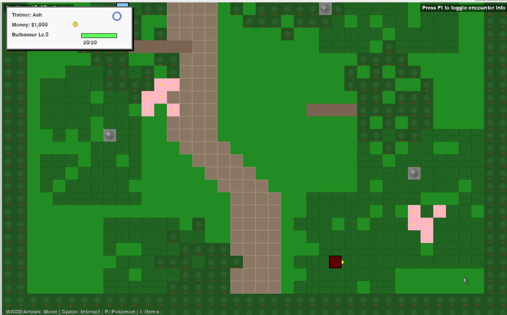
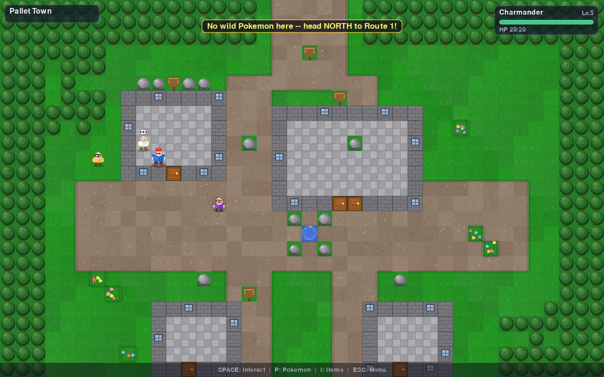
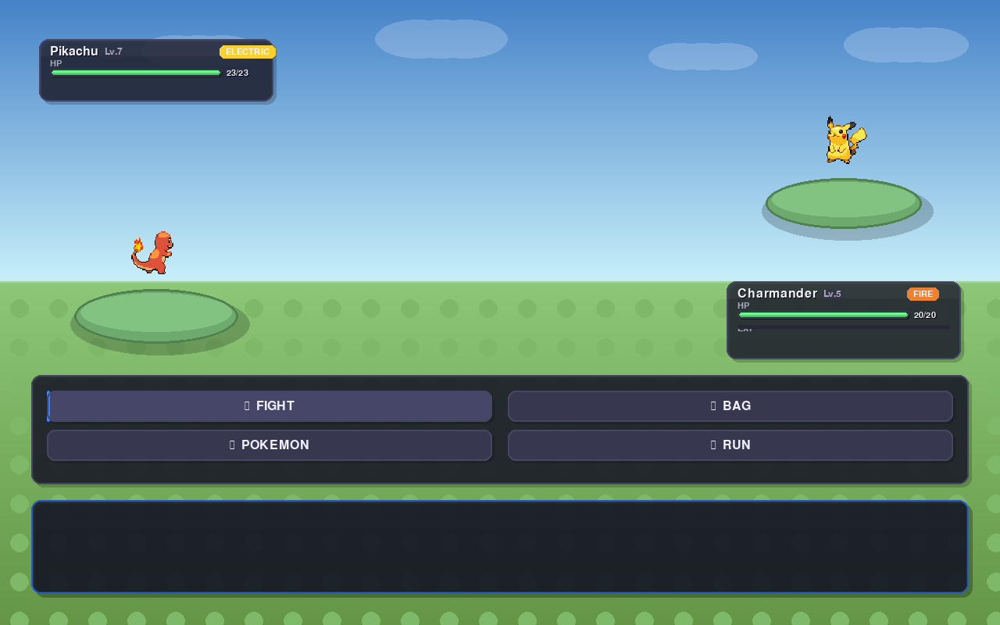
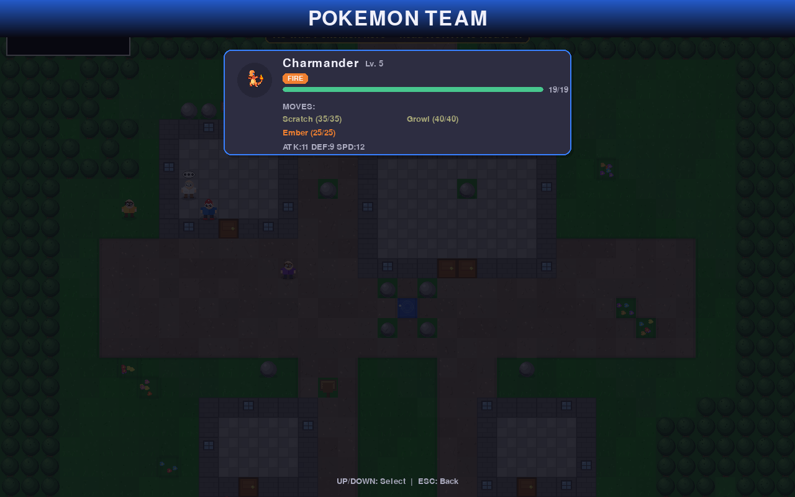
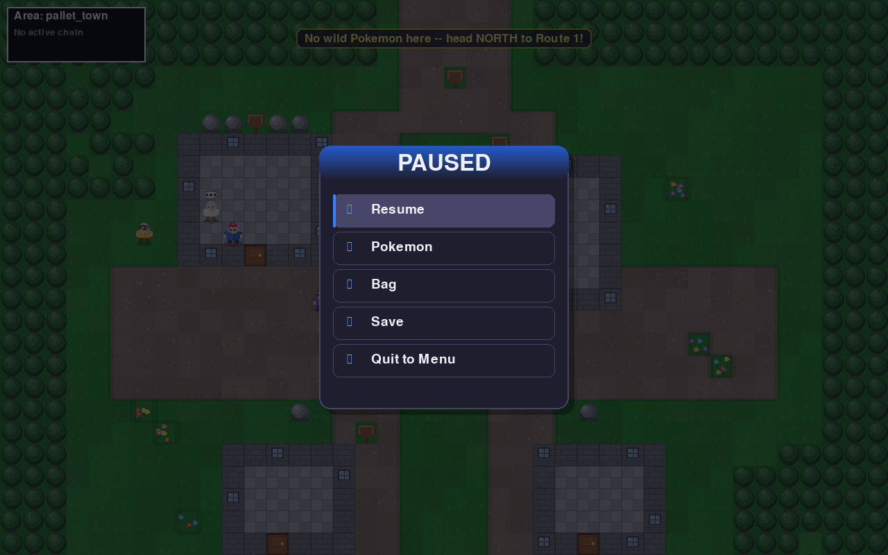
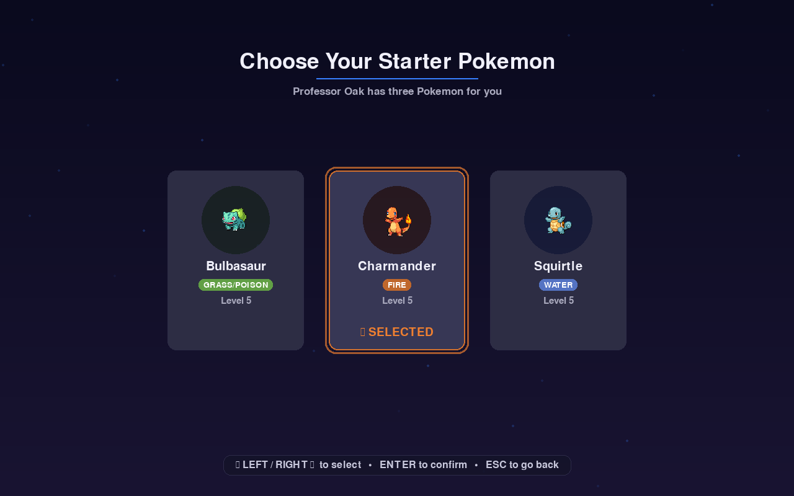

# Pokemon Game

A feature-rich Pokemon-style RPG game built with Python and Pygame, featuring turn-based battles, world exploration, and all the classic Pokemon mechanics.

## Before / After

### Before (2025 Claude)


### After (2026 Claude)

| World Exploration | Battle System |
|:-:|:-:|
|  |  |
| *Textured tiles, animated NPCs, character sprites* | *Gradient sky, type badges, HP bars* |

| Pokemon Team | Pause Menu |
|:-:|:-:|
|  |  |
| *Card layout with moves, stats, type badges* | *Dark-theme translucent overlay* |

| Starter Selection |
|:-:|
|  |
| *Choose Bulbasaur, Charmander, or Squirtle* |

## Features

### Core Gameplay
- **Starter Pokemon Selection** - Choose between Bulbasaur, Charmander, or Squirtle
- **Turn-Based Battle System** with type effectiveness (18 types), physical/special split, status conditions, critical hits, and leveling
- **22 Battle Animations** - Unique visual effects for every Pokemon type (fire, water, electric, psychic, ghost, etc.)
- **VS Screen** with split-screen animation when battles begin
- **Damage Popups** showing effectiveness text

### World Exploration
- **Grid-Based Movement** with smooth interpolation and running (Shift)
- **Textured Tile Rendering** - Grass blades, water ripples, brick patterns, flower animations, tree canopies
- **Character Sprites** - Player with cap/jacket/walking animation, NPCs with role-based outfits
- **Smooth Camera** with lerp following and map boundary clamping
- **Fade-to-Black Map Transitions** with area name banner
- **Day/Night Tint** based on system time
- **Ambient Effects** - Grass particles, water sparkles
- **NPC Interaction Indicators** - "!" for trainers, "..." for regular NPCs

### Pokemon System
- 14 Pokemon species with full stat systems (IVs, EVs, Natures)
- Abilities, move learning, PP system
- Shiny Pokemon (0.1% chance)
- Status conditions (Paralysis, Burn, Poison, Sleep, Freeze, Confusion)

### UI/UX
- **Dark Theme Design System** with consistent color palette
- **Battle UI** - Gradient HP bars, type badge pills, 2x2 move grid with PP/power/category
- **Pokemon Team Menu** - Card layout with expandable details
- **Bag Menu** - Category tabs with item descriptions
- **Pause Menu** - Translucent overlay with card-style buttons
- **Dialog System** - Semi-transparent boxes with typewriter text and bouncing arrow indicator
- **World HUD** - Location banner, mini Pokemon info, context action hints

### NPCs and Interactions
- Professor Oak, Rival Gary, Nurse Joy, Trainers, Townspeople
- Role-based outfits and hair colors
- Idle breathing animation and proximity indicators

## Getting Started

### Prerequisites
- Python 3.10+

### Setup

```bash
git clone https://github.com/gyupro/poketmon_game.git
cd poketmon_game
pip install -r requirements.txt
python main.py
```

Dependencies: pygame, requests, pillow

## Controls

### World
| Key | Action |
|-----|--------|
| Arrow Keys / WASD | Move |
| Shift | Run |
| Space | Interact |
| P | Pokemon Menu |
| I | Inventory |
| ESC | Pause |

### Battle
| Key | Action |
|-----|--------|
| Arrow Keys | Navigate |
| Enter/Space | Confirm |
| ESC | Back |
| 1-4 | Quick select move |

## Finding Wild Pokemon

1. Exit Pallet Town from the **top** (x=18-22, y=0)
2. Walk through **tall grass** in Route 1
3. Encounters trigger automatically (~12% per step)

## Project Structure

```
poketmon_game/
├── main.py                    # Entry point
├── src/
│   ├── game.py               # Game loop & state management
│   ├── pokemon.py            # Pokemon classes & species data
│   ├── battle.py             # Battle system
│   ├── battle_animations.py  # 22 type-specific visual effects
│   ├── ui.py                 # Modern dark-theme UI system
│   ├── world.py              # World, NPCs, camera, transitions
│   ├── map.py                # Tile rendering with textures
│   ├── player.py             # Player character & sprite
│   ├── encounters.py         # Wild encounter tables
│   ├── encounter_effects.py  # Encounter transition effects
│   └── items.py              # Item system
├── assets/
│   ├── sprites/              # Pokemon sprite images
│   ├── maps/                 # Map JSON data
│   └── screenshots/          # Game screenshots
├── tests/                    # Test suite
└── utils/                    # Sprite downloader
```

## Running Tests

```bash
pip install pytest
python -m pytest tests/ -v
```

## Disclaimer

This is a fan-made game for educational purposes. Pokemon is a trademark of Nintendo/Game Freak/Creatures Inc. Sprite assets from PokeAPI used under fair use.

## License

Educational purposes only. See repository for details.
