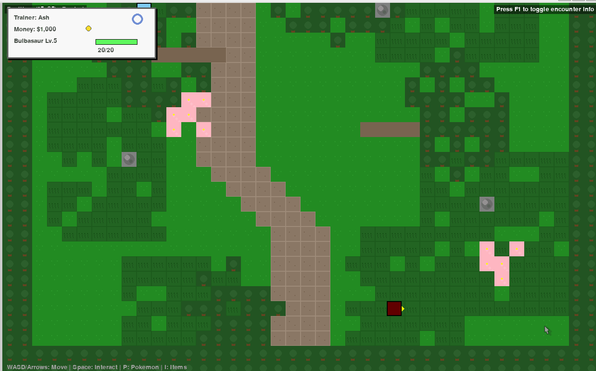
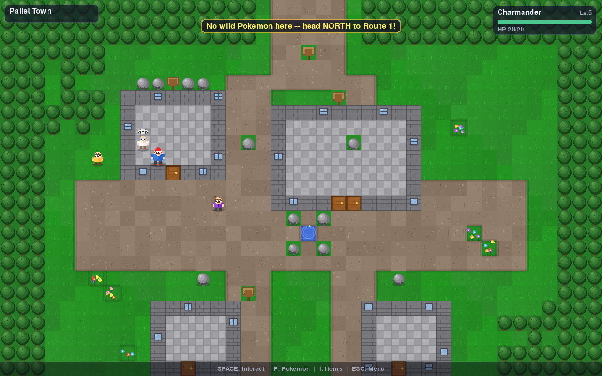
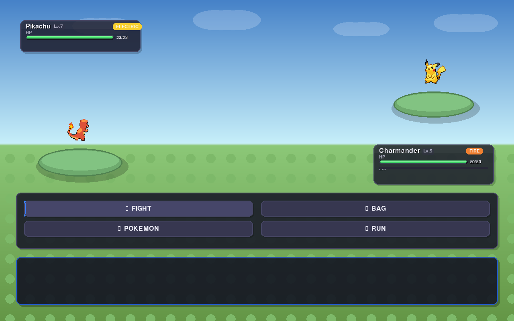
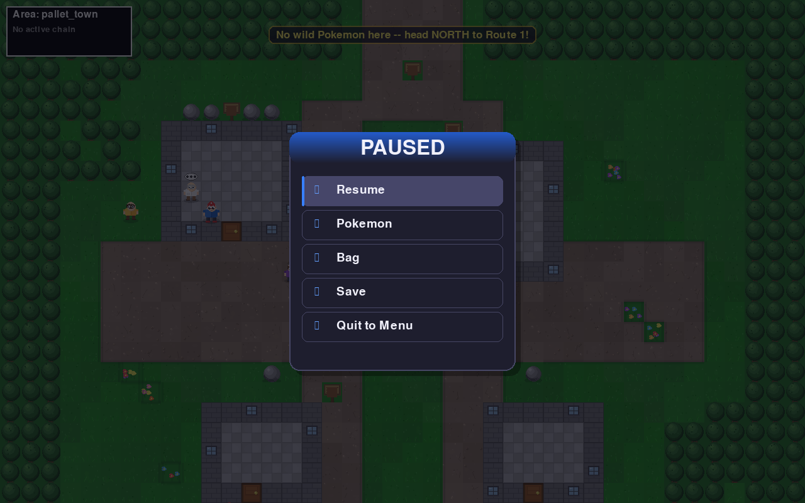
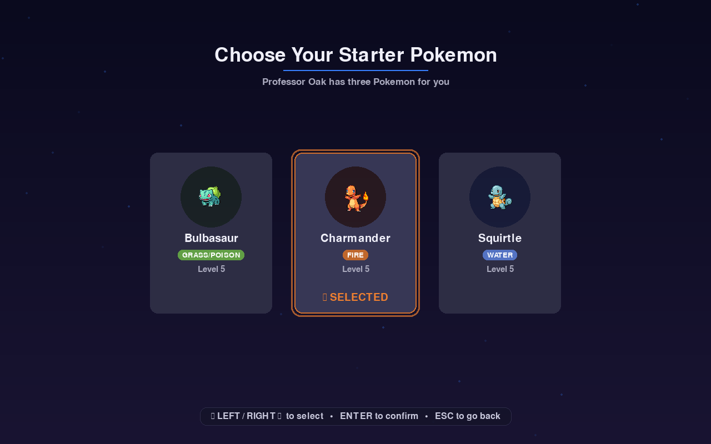
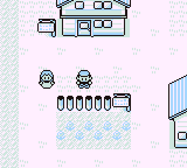
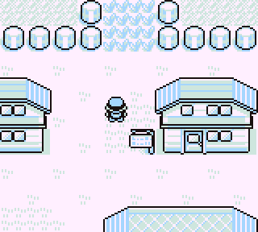

# Pokémon Red Online (Godot 4.4)

**English** | [한국어](README.ko.md)

> **A Pokémon game made by Claude Opus 5.5.**
> Everything — the design, the converter for the original game data, the game code, the sound renderer, the Korean translation and the testing — was written by Anthropic's Claude Opus 5.5 (Claude Code).

A record comparing the Pokémon games built by different versions of Claude.

## Before / After

### Before (2025 Claude)


### After (2026 Claude)

A Python + Pygame version. Its code lives on in the [`python-version` tag](https://github.com/gyupro/poketmon_game/tree/python-version).

| World Exploration | Battle System |
|:-:|:-:|
|  |  |
| *Textured tiles, animated NPCs, character sprites* | *Gradient sky, type badges, HP bars* |

| Pokemon Team | Pause Menu |
|:-:|:-:|
|  |  |
| *Card layout with moves, stats, type badges* | *Dark-theme translucent overlay* |

| Starter Selection |
|:-:|
|  |
| *Choose Bulbasaur, Charmander, or Squirtle* |

### Now (Claude Opus 5.5)

A **2-player co-op** remake of **Pokémon Red**, rebuilt in Godot. Every map, graphic, music track, Pokémon, move, trainer and line of dialogue is extracted from the original game's disassembly ([pret/pokered](https://github.com/pret/pokered)).
You can play the whole original story, from Pallet Town to the Champion, the Hall of Fame and the ending.

| Overworld · Battle · Surf | Story (Prof. Oak appears) |
|:---:|:---:|
|  |  |

> The game's text is currently in **Korean**. The original English dialogue is also in the data, but the menus are Korean-only for now.

## Features

- **All 222 original maps**, matching the original: tiles, collision, ledges, doors, warps, map connections, NPCs, signs and hidden items. Each town uses its Super Game Boy palette.
- **Gen 1 battles**:
  - Damage formula, critical hits, type matchups, status conditions and most move effects
  - Catching, experience, learning moves, evolution (level / stone / trade)
- **Music, sound effects and cries**: the original sound data is played through a recreation of the Game Boy sound chip and rendered to audio.
  - 45 music tracks, 104 sound effects, cries for all 151 Pokémon
- **Field moves**:
  - Cut, Surf, Strength, Flash, Fly, Dig, Teleport, Softboiled
  - Bicycle, three fishing rods, TMs and HMs
- **The full story**:
  - All 8 Gym Leaders
  - Team Rocket Hideout, Pokémon Tower, Silph Co. (card key doors)
  - Safari Zone, Cinnabar Gym quiz, Seafoam Islands, Victory Road puzzles
  - Elite Four, Champion, Hall of Fame, ending
- **Extras**: Game Corner slots and prizes, vending machines, the Name Rater, the Day Care, in-game trades, fossil revival, legendary Pokémon.
- **Korean localization**: about 1,870 lines of dialogue plus all Pokémon, move and item names.
- **Multiplayer (unverified)**: explore the same world with a friend, see each other, and do link battles and trades. It has barely been tested (see Test status).

## Test status

- **Single-player: tested.** An automated test harness ran every story event from Pallet Town to the ending.
  - All 8 Gym Leaders, rival battles, Rocket Hideout, Pokémon Tower, Silph Co.
  - Safari Zone, Cinnabar Island, Seafoam Islands, Victory Road, Elite Four, Champion, Hall of Fame
  - Field moves, in-game trades, Day Care, slots
- **Multiplayer: mostly untested.** The only checks were in an early build, with two copies of the game on one PC.
  - Checked: connecting, seeing each other, sending a battle request, battle turn sync
  - Not checked: trading, playing together with features added later (Surf, Bicycle, …), a real internet connection between different PCs
  - Expect bugs.

## Setup (from source)

The original graphics, music and data are Nintendo's property, so **they are not in this repository.**
Instead, a script generates them from the pret/pokered disassembly.

Requirements:
- [Godot 4.4.1](https://godotengine.org/download/archive/4.4.1-stable/) (Standard)
- Python 3.10+, `pip install pillow numpy`
- git

```bash
git clone https://github.com/gyupro/poketmon_game
cd poketmon_game
python tools/setup.py "C:\Godot\Godot_v4.4.1-stable_win64_console.exe"
```

What `setup.py` does:
1. Downloads pret/pokered into `pokered_src/`.
2. Renders the music and sound effects.
3. Converts maps, graphics and data.
4. Runs the Godot import.

When it finishes, run `play.bat` (if Godot is in `C:\Godot`), or open `game/project.godot` in the Godot editor and press F5.

To build a ready-to-run package for a friend, run `python tools/make_package.py`. It creates `dist/pokemon_online.zip`, which includes Godot; unzip it and run `play.bat`.

## Controls

| Key | Action |
|---|---|
| Arrow keys / WASD | Move (tap to turn in place) |
| Z / Space / J | A button (talk / confirm) |
| X / Backspace / K | B button (cancel) · hold while walking to run |
| Enter | START (menu) |
| Shift | SELECT · get on / off the bicycle |

Press A in front of a tree or water to use Cut or Surf directly.

## Playing with a friend

1. One player picks **방 만들기** (Host) on the title screen. Their IP appears on screen; send it to your friend.
2. The other player picks **친구 방 참가** (Join) and enters that IP.
3. When you're on the same map you can see each other. Press **A** in front of your friend to request a **battle / trade**.

- The game uses **UDP port 24680**. To play over the internet, use one of these:
  - A virtual LAN such as Radmin VPN / Tailscale / ZeroTier (easiest)
  - Port forwarding on the host's router
- Each player keeps their own save file.
  - Link battles don't affect your party, like the original's link battles.
  - Trades are real, and trade evolutions (Kadabra → Alakazam, etc.) work.

## Project layout

```
tools/
  setup.py           first-time setup (fetch pokered → render audio → convert data → import)
  convert.py         pokered → game/data/*.json, game/assets/**
  audio_render.py    recreates the pokered sound engine → music / SFX / cry WAVs
  ko_names.py        Korean names for Pokémon, moves, items and trainers
  make_package.py    builds the ready-to-run zip for friends
game/
  data/ko.json       Korean dialogue (keys: original text labels)
  scripts/core/      data, saves, Pokémon math, sound, networking, link battles/trades
  scripts/overworld/ overworld, characters, field moves, event dispatch
  scripts/story/     story scripts per region, Gym Leaders
  scripts/battle/    Gen 1 battle logic, battle screen / PvP
  scripts/ui/        dialogue box, menus, title
  scripts/debug/     automated tests (Godot --path game -- autotest=<command file>)
```

## Credits

- Original game: GAME FREAK / Nintendo / Creatures — Pokémon Red
- Disassembly: [pret/pokered](https://github.com/pret/pokered)
- Font: [Galmuri](https://github.com/quiple/galmuri) (SIL Open Font License 1.1)
- Development: **Claude Opus 5.5** (Anthropic, Claude Code)

This is a non-commercial fan project. All Pokémon rights belong to their respective owners.
